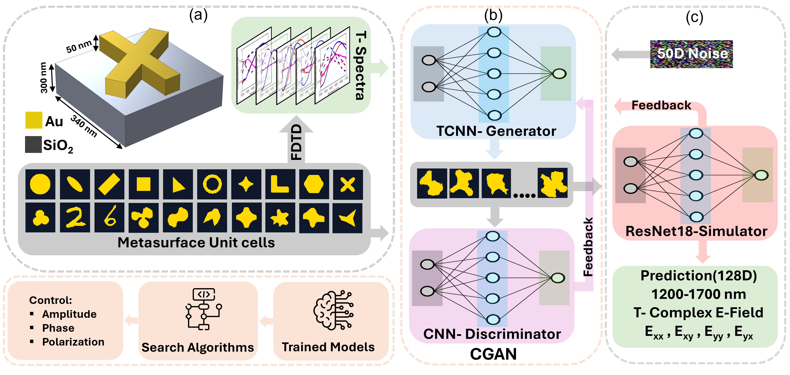

We are presenting a data-driven framework for inverse metasurface design and efficient forward prediction with promising application in spectral filter, polarization converter, and vector holography. This research was directed by Prof. Humeyra Caglayan from Eindhoven University of Technology (TU/e), Netherlands and the research team includes Md Imran Hossain and Linzhi Yu from Tampere University, Finland.

  
   
  <em>Schematic representation of the metasurface inverse design framework</em>

We have developed a ResNet-18–based neural network simulator that mimic the conventional numerical techniques such as FDTD, FEM, and FIT, thereby providing a computationally efficient path for metasurface inverse design within a Generative Adversarial Network (GAN) framework. Please see the concept figure for better understanding of the work.

This repository includes sample dataset, CGAN:generator and discriminator, and NN simulator(Resnet-18) model implementation in pytorch and their architecture. More information can be found on the article DOI:....

For any queries, please contact Prof. Humeyra Caglayan (h.caglayan@tue.nl)

This repository is shared with you under CC licence, hence you are required to cite the source when you use any content shared under this repository.  
